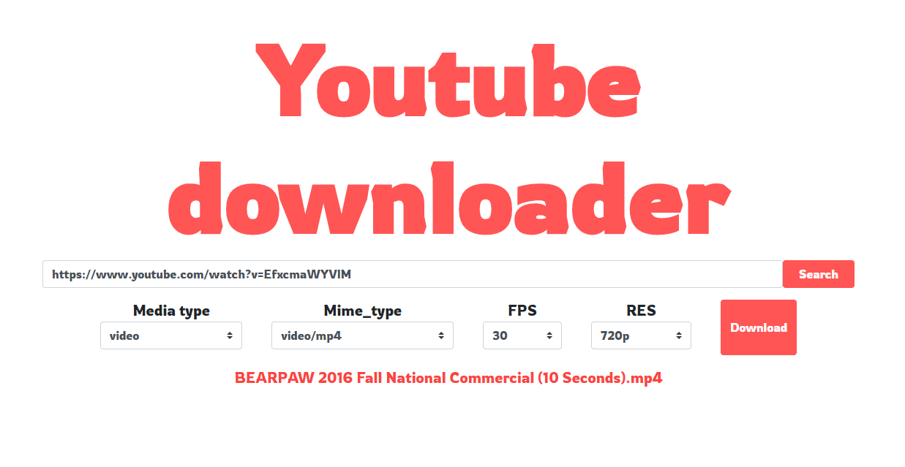

# Youtube downloader



You can download Youtube video using "Youtube downloader".

1. Copy Youtube video url and paste the url in "Youtube downloader".
2. Click "Download" button.
3. If the Youtube video is downloaded, you can see the download link in the bottom.
4. Click the download link then you can get the Youtube video.

## Dependency
```
# pip3 install pytube3
# pip3 install flask
# pip3 install apscheduler
```

## Points to note when developing
```
# set the downloaded video file in config.py

> set FLASK_APP=run.py
> set FLASK_ENV={release, dev, local}
> flask run
``` 
